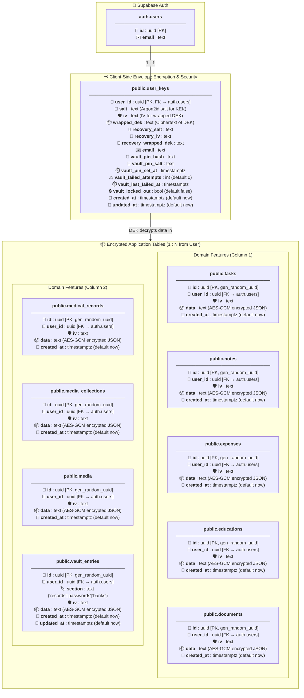

> **Data Architecture Summary:**
> - **Zero-Knowledge Architecture:** Supabase database stores ciphertext only.
> - **Row Shape:** All feature tables share the encrypted envelope pattern (`id`, `user_id`, `iv`, `data`, `created_at`).
> - **`vault_entries` Exception:** Stores plaintext `section` (`records`, `passwords`, `banks`) to permit scoped database filtering without decrypting all vault rows client-side.